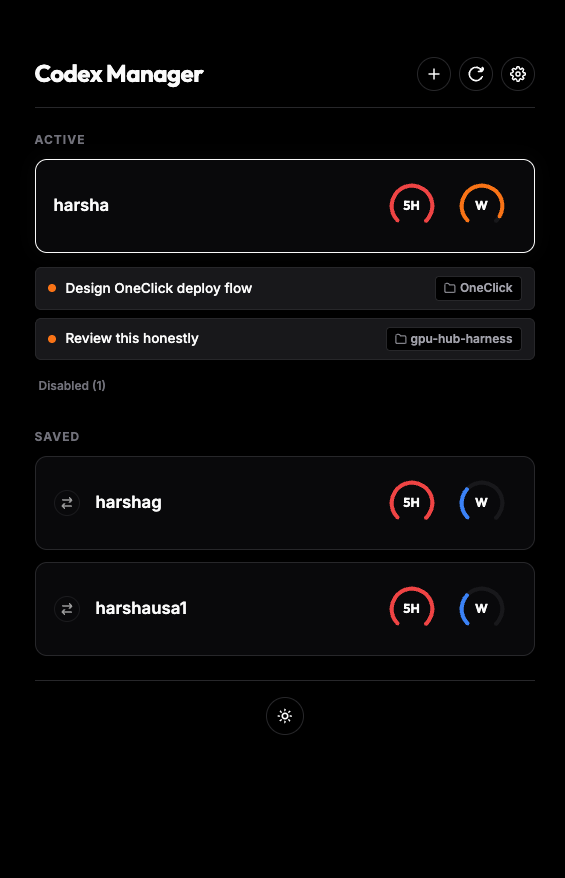

# 🪐 CodexManager

CodexManager is a lightweight, local daemon and dashboard designed to manage multiple Codex accounts and automatically hot-swap them before rate limits are hit. It keeps your AI coding flow uninterrupted by rotating credentials dynamically under the hood.



---

## 🚀 Features

- **Preemptive Auto-Rotation:** Monitors your active account's usage. Once it reaches a configurable threshold (e.g., 90%), CodexManager swaps in another vaulted account with the most headroom.
- **Minimal Disruption (Soft Reload):** Automatically bounces Codex's primary control-plane background process and triggers a renderer reload (via AppleScript) so the app picks up the new account without interrupting active conversation sessions.
- **Isolated Account Capture:** Log in to additional accounts safely. CodexManager spawns `codex login` in an isolated environment so you can authorize new accounts without logging out of your active session.
- **Interactive Dashboard:** Runs a clean, local web dashboard showing live 5-hour and weekly rate limit gauges, active thread goals, and your registered account profiles.
- **Optional Request Proxy (Experimental):** Features an opt-in local load-balancing reverse proxy that rotates accounts per request with no app restarts.

---

## 🛠 How It Works

CodexManager runs a local Node.js daemon that operates on two levels:

1. **The Active Registry (`~/.codex/auth_registry.json`):** Holds a vault of your registered accounts and their OAuth refresh tokens.
2. **File Swapping (Default):** Rewrites Codex's configuration at `~/.codex/auth.json` with fresh tokens whenever a swap occurs. It uses a soft-reload script to signal the Codex desktop app's control plane to load the new session instantly.

---

## 🏃‍♂️ How to Run

1. Clone or download this repository.
2. Open your terminal in the directory.
3. Make sure the start script is executable:
   ```bash
   chmod +x start.sh
   ```
4. Run the startup script:
   ```bash
   ./start.sh
   ```

This will spin up the Node server daemon in the background and open the dashboard in your default browser at **`http://localhost:19000`**.

---

## ⚙️ Configuration

Through the dashboard settings (gear icon), you can customize:
- **Auto-Swap Toggle:** Enable or disable automatic account swapping.
- **Rotation Threshold:** The usage percentage (default 90%) at which an account is rotated out.
- **Reload Mode:** Choose between `New sessions only` (no restarts), `Soft` (bounce backend control plane + reload browser page), or `Relaunch` (full quit and restart Codex).
